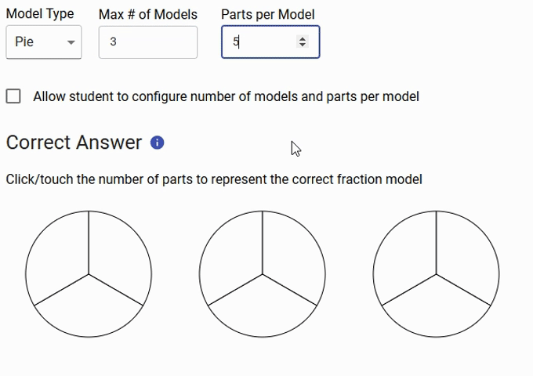

# fraction-model-item-type


A [pie](https://www.npmjs.com/package/pie) interaction that renders an interactive fraction model item type.

## Demo

```shell
npm install -g pie
git clone git@github.com:pie-framework/pie-elements.git
cd packages/fraction-model
pie info 
```

### Test

```shell 
npm test
```