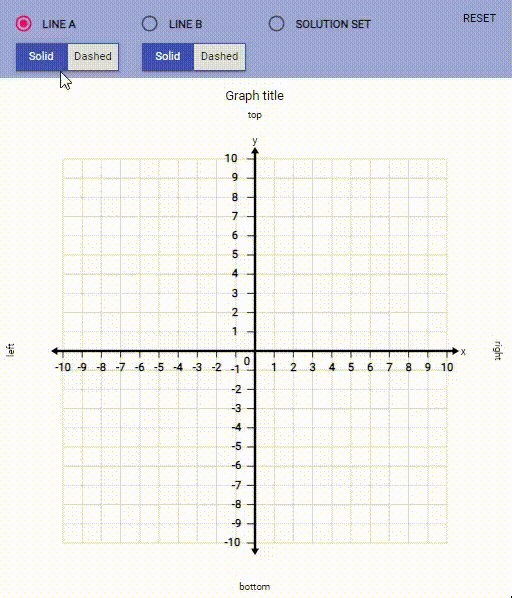

# @pie-element/graphing-solution-set



A [pie](https://www.npmjs.com/package/pie) interaction that renders an interactive graphing solution set.

## Demo

```shell
npm install -g pie
git clone git@github.com:pie-framework/pie-elements.git
cd packages/graphing-solution-set
pie info 
```

### Test

```shell 
npm test
```
